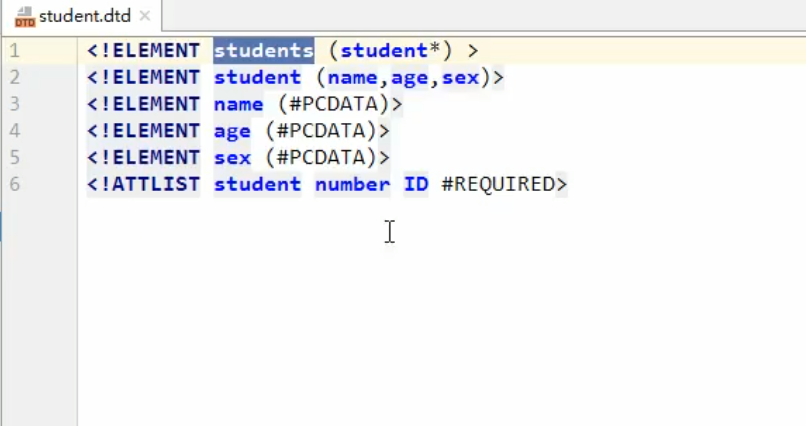
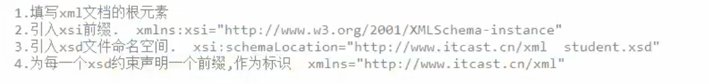

## XML

1.  概念
    1.  概念:可拓展标记语言

        ​	可拓展:标签是自定义的

    2.  功能:存储数据

        1.  配置文件
        2.  网络中传输

    3.  xml和html区别:

        1.  xml标签完全自定义
        2.  xml语法严格,html语法松散
        3.  xml存数据,html展示数据

2.  语法
    1.  基本语法:
        1.  xml文档后缀 .xml
        2.  第一行必须写文档声明
        3.  xml文档中有且仅有一个根标签
        4.  标签必须闭合
        5.  严格区分大小写(html不区分)
        
    2.  快速入门:

    3.  组成部分:

        1.  文档声明

            1.  格式:

                ```xml
                <?xml 属性列表 ?>
                ```

            2.  属性列表

                1.  `version` 版本号 

                2.  `encoding` 编码方式

                    ​	告知解析引擎当前文档使用的字符集.(默认ISO)

                3.  `standalone`  是否独立

                    ​	yes:不依赖其他文件

                    ​	no:依赖其他文件

        2.  指令:结合CSS

            ```xml
            <?xml-stylesheet type="text/css" href="a.css" ?>
            ```

        3.  标签:名称自定义

            XML元素必须遵循以下命名规则:

            -   名称可以含字母、数字以及其他的字符
            -   名称不能以数字或者标点符号开始
            -   名称不能以字符"xml" (或者XML、Xml) 开始
            -   名称不能包含空格

        4.  属性

            1.  id值唯一

        5.  文本

            CDATA区:在此区域的数据会被原样展示

            ```xml
            <![CDATA[ 代码 ]]>
            ```

3.  约束:规定xml文档的书写规则

    1.  要求

        1.  在xml中引用约束文档
        2.  读懂约束文档

    2.  分类

        1.  DTD:简单约束文档

            

            1.  引入DTD文档到xml文档中

                1.  内部dtd:将约束定义在xml文档中

                2.  外部dtd:将约束规则定义在外部的dad文件中

                    1.  本地 

                        ```xml
                        <!DOCTYPE 根标签名 STSTEM "dtd文件路径"
                        ```

                    2.  网络

                        ```xml
                        <!DOCTYPE 根标签名 PUBLIC "dtd文件名" "dtd文件URL"
                        ```

        2.  Schema:复杂约束文档

            1.  引入

                

            2.  读懂

4.  解析:操作xml文档,将文档中的数据读到内存中

    1.  操作xml文档

        1.  解析(读取):将文档中的数据读取到内存中
        2.  写入:将内存中的数据保存到xml文档中.持久化地存储

    2.  解析xml的方法(思想)

        1.  DOM:将标记语言一次性加载进内存,形成一颗DOM树 -> 服务器
            1.  优点:操作方便,便于增删改查
            2.  缺点:太占内存
        2.  SAX:逐行读取,基于事件驱动 -> 移动端
            1.  优点:不占多少内存
            2.  缺点:只能读取,不能增删改

    3.  xml常见的解析器

        1.  JAXP :sun公司提供的解析器,支持dom和sax
        2.  DOM4J :很优秀
        3.  Jsoup :是一款Java 的HTML解析器，可直接解析某个URL地址、HTML文本内容。它提供了一套非常省力的API，可通过DOM，CSS以及类似于jQuery的操作方法来取出和操作数据。
        4.  PULL : Android 内置的解析器,sax方式

        快速入门:Jsoup

        步骤: