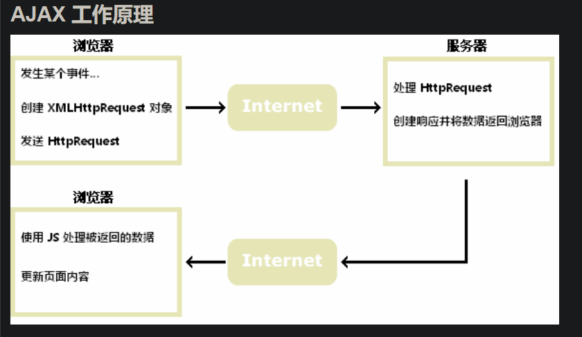
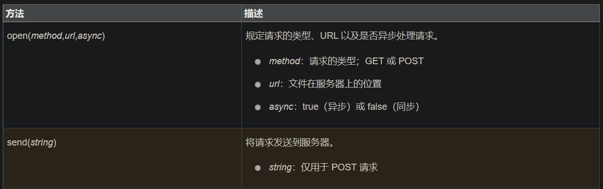
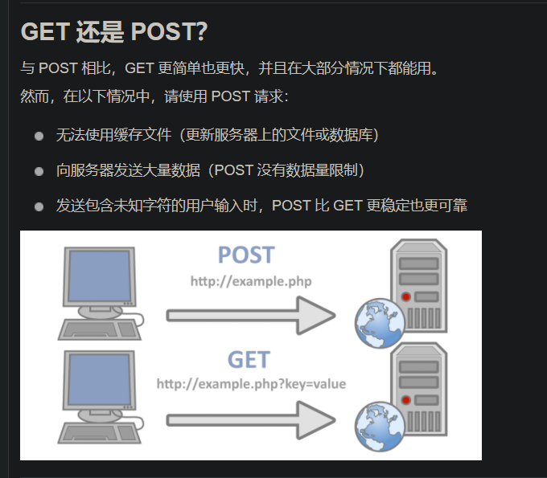
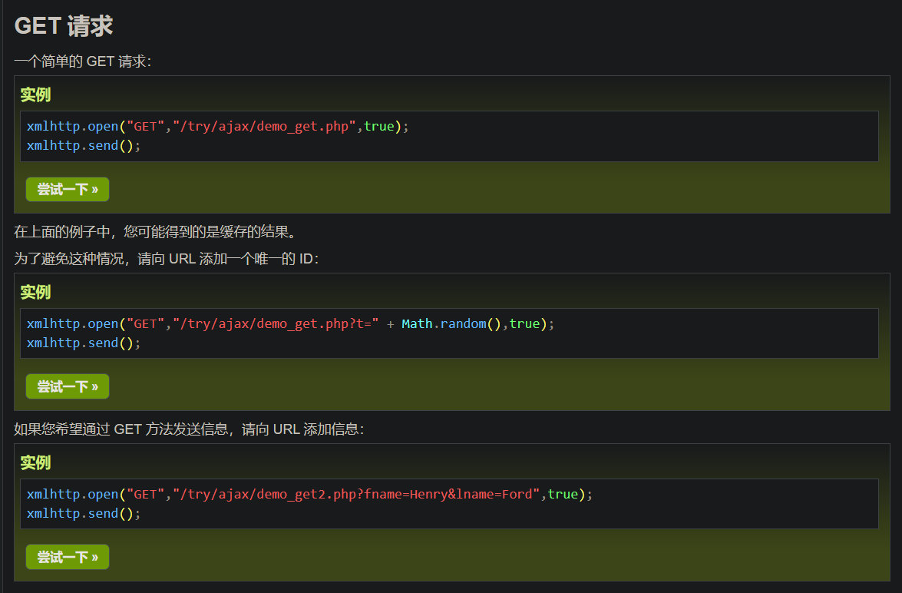
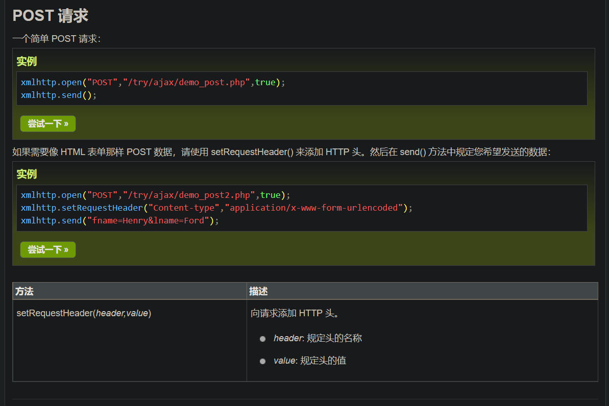
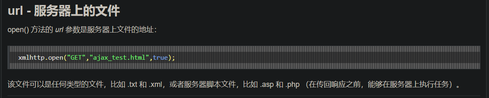
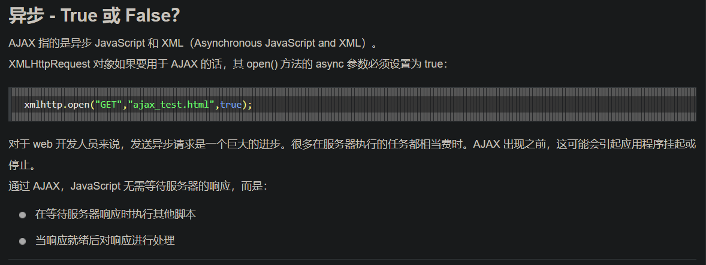
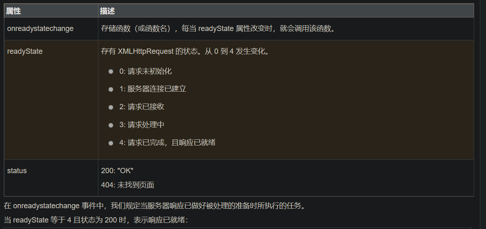

# AJAX

## 什么是AJAX

```xml
AJAX = Asynchronous JavaScript and XML（异步的 JavaScript 和 XML）。
AJAX 不是新的编程语言，而是一种使用现有标准的新方法。
AJAX 最大的优点是在不重新加载整个页面的情况下，可以与服务器交换数据并更新部分网页内容。
AJAX 不需要任何浏览器插件，但需要用户允许JavaScript在浏览器上执行。
```

## 工作原理



## 实例

```html
<!DOCTYPE html>
<html>
<head>
<meta charset="utf-8">
<script>
function loadXMLDoc()
{
    //创建 XMLHttpRequest 对象
	var xmlhttp;
	if (window.XMLHttpRequest)
	{
		//  IE7+, Firefox, Chrome, Opera, Safari 浏览器执行代码
		xmlhttp=new XMLHttpRequest();
	}
	else
	{
		// IE6, IE5 浏览器执行代码
		xmlhttp=new ActiveXObject("Microsoft.XMLHTTP");
	}
    //为服务器产生的响应绑定处理函数
	xmlhttp.onreadystatechange=function()
	{
        //判断响应是否成功
		if (xmlhttp.readyState==4 && xmlhttp.status==200)
		{
			document.getElementById("myDiv").innerHTML=xmlhttp.responseText;
		}
	}
    //向服务器发送请求
	xmlhttp.open("GET","/try/ajax/ajax_info.txt",true);
	xmlhttp.send();
}
</script>
</head>
<body>

<div id="myDiv"><h2>使用 AJAX 修改该文本内容</h2></div>
<button type="button" onclick="loadXMLDoc()">修改内容</button>

</body>
</html>
```

## AJAX - 创建 XMLHttpRequest 对象

```js
variable = new XMLHttpRequest();
//老版本的浏览器(IE5/IE6)需要这样
variable=new ActiveXObject("Microsoft.XMLHTTP");
```

### 举例

```js
var xmlhttp;
if (window.XMLHttpRequest)
{
    //  IE7+, Firefox, Chrome, Opera, Safari 浏览器执行代码
    xmlhttp=new XMLHttpRequest();
}
else
{
    // IE6, IE5 浏览器执行代码
    xmlhttp=new ActiveXObject("Microsoft.XMLHTTP");
}
```

## AJAX - 向服务器发送请求

1.  向服务器发送请求

    如需将请求发送到服务器，我们使用 **XMLHttpRequest** 对象的 **open()** 和 **send()** 方法：

    ```js
    xmlhttp.open("GET","ajax_info.txt",true);
    xmlhttp.send();
    ```

2.  方法:

    

3.  Get 和 Post

    

    1.  GET

        

    2.  POST

        

4.  URL

    

5.  异步

    

    1. Async=true

        当使用 async=true 时，请规定在响应处于 onreadystatechange 事件中的就绪状态时执行的函数：

       ```js
       xmlhttp.onreadystatechange=function()
       {
           if (xmlHttp.readyState==4 && xmlHttp.status==200)
           {
               document.getElementById("myDiv").innerHTML=xmlHttp.responseText;
           }
       }
       xmlhttp.open("GET","/try/ajax/ajax_info.txt",true);
       xmlhttp.send();
       ```

    2. Async=false

        如需使用 async=false，请将 open() 方法中的第三个参数改为 false：

        ```js
        xmlHttp.open("GET","test.txt",false);
        ```

        我们不推荐使用 async=false，但是对于一些小型的请求，也是可以的。

        请记住，JavaScript 会等到服务器响应就绪才继续执行。如果服务器繁忙或缓慢，应用程序会挂起或停止。

        **注意：**当您使用 async=false 时，请不要编写 onreadystatechange 函数 - 把代码放到 send() 语句后面即可：

       ```js
       xmlhttp.open("GET","/try/ajax/ajax_info.txt",false);
       xmlhttp.send();
       document.getElementById("myDiv").innerHTML=xmlHttp.responseText;
       ```

## AJAX - 服务器响应

1.  服务器响应

    如需获得来自服务器的响应，请使用 XMLHttpRequest 对象的 responseText 或 responseXML 属性。

2.  responseText 属性

    如果来自服务器的响应并非 XML，请使用 responseText 属性。

    responseText 属性返回字符串形式的响应，因此您可以这样使用：

    ```js
    document.getElementById("myDiv").innerHTML=xmlHttp.responseText;
    ```

3.  responseXML 属性

    如果来自服务器的响应是 XML，而且需要作为 XML 对象进行解析，请使用 responseXML 属性：

    样例:

    ```html
    <!DOCTYPE html>
    <html>
    <head>
    <meta charset="utf-8">
    <script>
    function loadXMLDoc()
    {
      var xmlhttp;
      var txt,x,i;
      if (window.XMLHttpRequest)
      {
        // IE7+, Firefox, Chrome, Opera, Safari 浏览器执行代码
        xmlhttp=new XMLHttpRequest();
      }
      else
      {
        // IE6, IE5 浏览器执行代码
        xmlhttp=new ActiveXObject("Microsoft.XMLHTTP");
      }
      xmlhttp.onreadystatechange=function()
      {
        if (xmlhttp.readyState==4 && xmlhttp.status==200)
        {
          xmlDoc=xmlhttp.responseXML;
          txt="";
          x=xmlDoc.getElementsByTagName("ARTIST");
          for (i=0;i<x.length;i++)
          {
            txt=txt + x[i].childNodes[0].nodeValue + "<br>";
          }
          document.getElementById("myDiv").innerHTML=txt;
        }
      }
      xmlhttp.open("GET","cd_catalog.xml",true);
      xmlhttp.send();
    }
    </script>
    </head>
    
    <body>
    
    <h2>我收藏的 CD :</h2>
    <div id="myDiv"></div>
    <button type="button" onclick="loadXMLDoc()">获取我的 CD</button>
     
    </body>
    </html>
    ```

## AJAX - onreadystatechange 事件

### onreadystatechange 事件

当请求被发送到服务器时，我们需要执行一些基于响应的任务。

每当 readyState 改变时，就会触发 onreadystatechange 事件。

readyState 属性存有 XMLHttpRequest 的状态信息。

下面是 XMLHttpRequest 对象的三个重要的属性：



举例:

```js
xmlHttp.onreadystatechange = function () {
    if (xmlHttp.readyState == 4 && xmlHttp.status == 200) {
        document.getElementById("myDiv").innerHTML = xmlHttp.responseText;
    }
}
```

**注意：** onreadystatechange 事件被触发 4 次（0 - 4）, 分别是： 0-1、1-2、2-3、3-4，对应着 readyState 的每个变化。

### 使用回调函数

回调函数是一种以参数形式传递给另一个函数的函数。

如果您的网站上存在多个 AJAX 任务，那么您应该为创建 XMLHttpRequest 对象编写一个*标准*的函数，并为每个 AJAX 任务调用该函数。

该函数调用应该包含 URL 以及发生 onreadystatechange 事件时执行的任务（每次调用可能不尽相同）：

```html
<!DOCTYPE html>
<html>
<head>
    <script>
        let xmlHttp;

        function loadXMLDoc(url, cFunc) {
            if (window.XMLHttpRequest) {// IE7+, Firefox, Chrome, Opera, Safari 代码
                xmlHttp = new XMLHttpRequest();
            } else {// IE6, IE5 代码
                xmlHttp = new ActiveXObject("Microsoft.XMLHTTP");
            }
            xmlHttp.onreadystatechange = cFunc;
            xmlHttp.open("GET", url, true);
            xmlHttp.send();
        }

        function myFunction() {
            loadXMLDoc("/try/ajax/ajax_info.txt", function () {
                if (xmlHttp.readyState === 4 && xmlHttp.status === 200) {
                    document.getElementById("myDiv").innerHTML = xmlHttp.responseText;
                }
            });
        }
    </script>
</head>
<body>

<div id="myDiv"><h2>使用 AJAX 修改文本内容</h2></div>
<button type="button" onclick="myFunction()">修改内容</button>

</body>
</html>
```

## AJAX ASP/PHP 实例

AJAX 用于创造动态性更强的应用程序。

举例:

```html
<!DOCTYPE html>
<html lang="en">
<head>
    <meta charset="UTF-8">
    <title>Title</title>
    <script>
        function showHint(str) {
            let xmlHttp;
            if (str.length == 0) {
                document.getElementById("txtHint").innerHTML = "";
                return;
            }
            if (window.XMLHttpRequest) {
                xmlHttp = new XMLHttpRequest();
            } else {
                xmlHttp = new ActiveXObject("Microsoft.XMLHTTP");
            }
            xmlHttp.open("GET", "/try/ajax/gethint.php?q=" + str, true);
            xmlHttp.send();
        }
    </script>
</head>
<body>
<h3>在输入框中尝试输入字母 a:</h3>
<form action="#">
    输入姓名: <input type="text" id="txt1" onkeyup="showHint(this.value)"/>
</form>
<p>提示信息: <span id="txtHint"></span></p>
</body>
</html>
```

## AJAX XML 实例

```html
<!DOCTYPE html>
<html>
<head>
<meta charset="utf-8">
<style>
table,th,td {
  border : 1px solid black;
  border-collapse: collapse;
}
th,td {
  padding: 5px;
}
</style>
</head>
<body>

<h1>XMLHttpRequest 对象</h1>

<button type="button" onclick="loadXMLDoc()">获取我收藏的 CD</button>
<br><br>
<table id="demo"></table>

<script>
function loadXMLDoc() {
  var xhttp = new XMLHttpRequest();
  xhttp.onreadystatechange = function() {
    if (this.readyState == 4 && this.status == 200) {
      myFunction(this);
    }
  };
  xhttp.open("GET", "cd_catalog.xml", true);
  xhttp.send();
}
function myFunction(xml) {
  var i;
  var xmlDoc = xml.responseXML;
  var table="<tr><th>Artist</th><th>Title</th></tr>";
  var x = xmlDoc.getElementsByTagName("CD");
  for (i = 0; i <x.length; i++) {
    table += "<tr><td>" +
    x[i].getElementsByTagName("ARTIST")[0].childNodes[0].nodeValue +
    "</td><td>" +
    x[i].getElementsByTagName("TITLE")[0].childNodes[0].nodeValue +
    "</td></tr>";
  }
  document.getElementById("demo").innerHTML = table;
}
</script>

</body>
</html>
```

